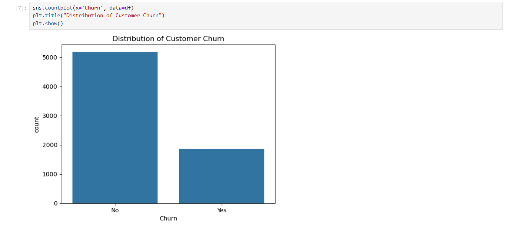
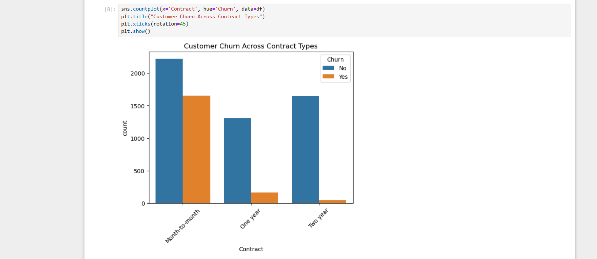
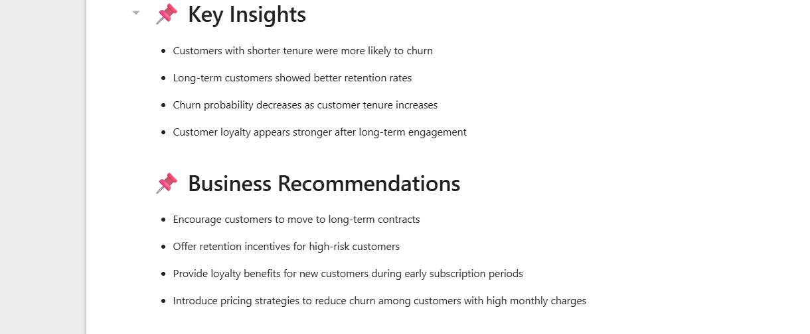

# Customer Churn Analysis

## Project Overview
This project analyzes customer churn behavior using exploratory data analysis (EDA) techniques to identify factors contributing to customer attrition.

## Tools & Technologies
- Python
- Pandas
- Matplotlib
- Seaborn
- Jupyter Notebook

## Business Problem
Customer churn impacts business revenue and customer retention. This project identifies patterns related to churn behavior.

## Key Insights
- Customers with shorter tenure were more likely to churn
- Month-to-month contracts showed higher churn rates
- Higher monthly charges increased churn probability
- Long-term customers had better retention

## Business Recommendations
- Encourage long-term contracts
- Provide retention offers for high-risk customers
- Improve customer engagement strategies

## Project Files
- Customer_Churn_Analysis.ipynb

## Conclusion
This analysis demonstrates how data analysis can support customer retention strategies and business decision-making.

## Project Screenshots

### Customer Churn Distribution

### Contract Type Analysis

### Key Insights

